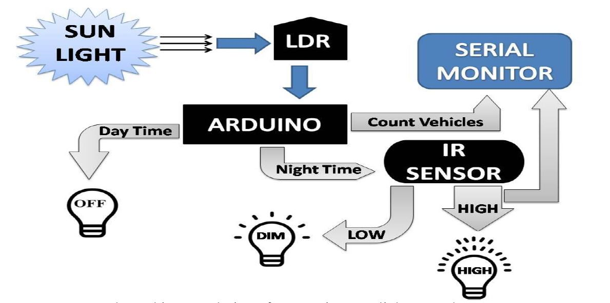

# Smart StreetLight Control System using Arduino
------------

###### Smart Streetlight is an automated system which automates the street. The main aim of Smart Streetlight is to reduce the power consumption when there are no vehicle movements on the road.

##### Documentation :
This [documentation ](https://github.com/mohamedrizwan4518/smart-street-light-system/blob/main/Smart_Streetlight_Control_System.pdf) provides detailed information of the Project. 

###### Hardware Used :
- Arduino Nano
- LDR
- LEDs
- IR sensor
- Resistors
- Few Jumper Cables
- USB Cable

##### Software Used : 
- Sketch Arduino IDE

##### Architecture Design

##### Working
- Firstly, Arduino Board receives input from the sensors (LDR,) and the battery
connected to the board.
- After processing the data input from LDR, if the input is below threshold voltage, IR Sensors get activated, and it determines, if object is present or not, and send back data to Arduino Board.
- If object is detected, the LED get ON, else it is in OFF mode.

##### Code
This is [Arduino Code](https://github.com/iamkrvikash/street-light/blob/master/arduino_code.ino "Arduino Code ") to perform the task.

#### Team Members
 - Arpita Sinha     [LinkedIn Profile](https://www.linkedin.com/in/arpita-sinha-3582151b4/)
 - Siddharth Nanda [LinkedIn Profile](https://www.linkedin.com/in/siddharth-nanda-2b65a0142/)
 - Vikash Kumar     [LinkedIn Profile](https://www.linkedin.com/in/iamkrvikash/)

------------
